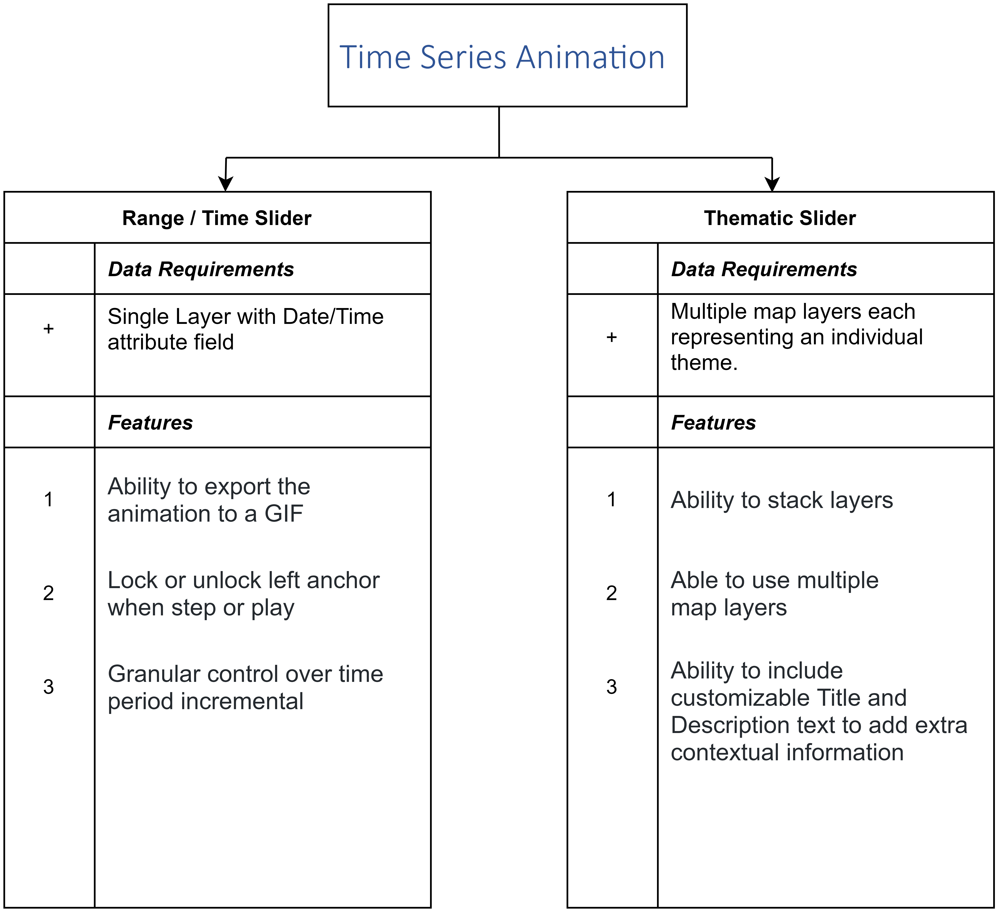

# Time Series Animation

Animations are an interesting way of visualizing time-series data. It distinctively gives the ability to observe how the data evolves.

One of the interesting topics, which can benefit from time-series animations, is cumulative effects. Cumulative effects also referred to as and cumulative impacts can be defined as changes to the environment caused by the combined impact of past, present, and future human activities and natural processes. [Wikipedia](<https://en.wikipedia.org/wiki/Cumulative_effects_(environment)>)

Depending on the way your data is structured, there are two plugins available, which will allow you to implement time-series animations. Each plugin provides unique features to best allow the user to interact with your data.
To help you decide, here we have a decision tree, which outlines the core differences between the two plugins.

1. [Range / Time Slider Plugin](../plugin/rangetimeslider.md)
2. [Thematic Slider Plugin](../plugin/thematicslider.md)

## Data Structure

The data structure is an important factor that needs consideration when determining what plugin should be used. Each plugin has different requirements that ensure that they work effectively.

### Time as an attribute

**[Range / Time Slider Plugin](../plugin/rangetimeslider.md)**

If your data has an attribute where the date is listed then the range/time slider is the best option to be used. The most important requirement is that your date column contains valid timestamp values, otherwise the data may not appear correctly. A column that includes a timestamp could be a date, created at, updated at, posted time, and so on. For example, the following image shows the value of a date column in the Data View.
Here are a few [Usecases](/plugin/rangetimeslider/#use-case-examples)

<!-- fix links to point to the # -->

### Temporal data as a map layer

**[Thematic Slider Plugin](../plugin/thematicslider.md)**

If your dataset consists of multiple raster layers (static maps) as a map service or as layers that corresponds to a particular period then the thematic slider is the best option.
Here are a few [Usecases](/plugin/thematicslider/#use-case-examples)

<!-- fix links to point to the # -->
