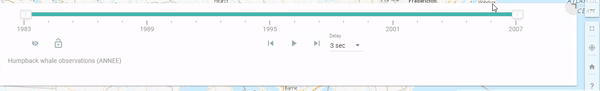

# What is the Range/Time Slider

The Range/Time Slider offers a dynamic way to visualize your data. The basic slider is a horizontal bar and has anchors that can be moved to establish the range of the values to be used. To visualize your data as a dynamic range, you can use any layer that contains numeric or date fields.
Once you define the range properties for your layer, an interactive, on-screen slider is used to explore the data through a range/time you customized. Using this plugin, you can control the animation of the data with buttons to play and pause, go to the previous range/time, and go to the next range/time.

> The Range/Time Slider plugin simplifies the visualization of temporal data in your maps. Before adding the Time Slider to your application, you first should understand how it can be configured to correctly display your temporal data. The plugin properties can be set using any numerical or date field stored in the attribute field. For example, a range of values for a particular parameter.

 

## Advantages of the Range/Time Slider

**What are the advantages of using the Range/Time Slider plugin?**

The Range/Time Slider plugin offers many advantages to both the data contributor and the user.

1.  The main advantage to the data contributor when using the Range/Time Slider plugin is the ability to provide Time Series Animation or Range filtering of the data using only one layer.

2.  The advantages the Range/Time Slider provides to the user can be summarized in the following points:

    - The ability to animation a GIF.
    - Granular control over the time increment
    - Lock or unlock the anchors when step or play.

!!! tip

    Click on the top right corner to activate compact mode

    

---

 

## Best Pratices

**Get the best out of the Range/Time Slider**

The Range/Time Slider is best used in cases where you have a mapservice/layer with a numeric / date field. In this regard, you can filter the data using the slider and the results are displayed dynamically on the map.
Take, for example, this map layer [General distribution of humpback whales in the Estuary and Gulf of St. Lawrence](https://gcgeo.gc.ca/geonetwork/metadata/eng/8cf43e2b-f276-4fb7-8d3a-e20fecc618b4){target=\_blank} dataset.
If we look at the map service for this dataset, we can see that there are a few fields that can work with the Range/Time Slider Plugin. In this example, the “Year” field was used.

> Utilizing the Range/Time Slider together with this rich data, we can dynamically filter the data to narrow results immediately.

> You can interactively adjust the minimum and maximum values of the displayed range, or move the entire range up and down. The slider and range settings are fully configurable using the Range tab, allowing you to look through the full range extent of your data using logical increments.

> By pressing the play button, the map will begin a time-series animation based on the range set. This may be 1-year or 5-year increments. This is a useful ability to determine trends or patterns occurring within the dataset.

<iframe id="iframe1" allowfullscreen=true importance = high data-src="https://jolevesq.github.io/contributed-plugins/range-slider/samples/range-slider-index.html?sample=14"></iframe>
!!! note

    Click on the full screen button to enter an expansive view.

---

 

## Use Case Examples

**Range Slider**

In this example, the Range/Time Slider plugin was used with the Hydroelectric [layer](https://geoappext.nrcan.gc.ca/arcgis/rest/services/NACEI/energy_infrastructure_of_north_america_en/MapServer/20){target=\_blank}. This layer is an example of an ESRI Feature layer being used with the range slider. The Total_MW field was used with the range slider plugin to give the ability to the viewer to select specific amount of power generation they may be interested in.

It is important to note the data structure of this layer. Looking closer at this dataset we can see that the Total_MW field consists of only integers. This enables the range slider to automatically identify the limits of the ranges present.

<iframe id="iframe2" allowfullscreen=true importance = high data-src="https://jolevesq.github.io/contributed-plugins/range-slider/samples/range-slider-index.html?sample=1"></iframe>

**Time Series**

In this example, the Range/Time Slider was used with the [Ocean Data Inventory Temperature](https://gcgeo.gc.ca/geonetwork/metadata/eng/7da1f04f-49b0-4208-a49e-d0597b1f55c6){target=\_blank} and [Ocean Data Inventory Salinity](https://gcgeo.gc.ca/geonetwork/metadata/eng/7da1f04f-49b0-4208-a49e-d0597b1f55c6){target=\_blank} datasets. The plugin was used with the “COLLECTION_START_DATE” it is interesting to note that both layers share the same field in this example. This made it easier to use the Range/Time Slider plugin with both layers simultaneously.

<iframe id="iframe3" allowfullscreen=true importance = high data-src="https://jolevesq.github.io/contributed-plugins/range-slider/samples/range-slider-index.html?sample=15"></iframe>

!!! tip

    Use the anchors on the left and right to set the range of values to be displayed.

---

 
## Configure the Range/Time Slider Plugin

The plugin works with the following mapping services:

- ESRI Feature
- ESRI Dynamic
- ESRI WMS
- ESRI Image
- OGC WMS
- OGC WMS-T
- OGC WCS

More information on Web map services can be found [here.](https://www.nrcan.gc.ca/earth-sciences/geomatics/canadas-spatial-data-infrastructure/8902){target=\_blank}

## Definition of Parameters

To configure this plugin to work with a mapping web service the following parameters are required.

<table>
  <tr>
    <th></th>
    <th>Parameters</th>
    <th>Description</th>
  </tr>
  <tr>
    <th rowspan="3">General</th>
    <td id=parameters>Open</td>
    <td >Determines if the plugin will open/load automatically when a layer loads. By default it is set to open on map load</td>
  </tr>
    <tr>
    <td id=parameters>Autorun</td>
    <td>Allows the animation to start automatically when the map loads.</td>
  </tr>
    <tr>
    <td id=parameters>Loop</td>
    <td>Allows the animation to restart automatically when it reaches the end of the array</td>
  </tr>
  <tr>
    <th rowspan="5">Slide Bar Controls</th>
    <td id=parameters>Lock</td>
    <td>Lock or unlock left anchor when step or play</td>
  </tr>
  <tr>
    <td id=parameters>Loop</td>
    <td>Loop the animation</td>
  </tr>
    <tr>
    <td id=parameters>Delay</td>
    <td>Add a dropdown menu to change the delay in play animation</td>
  </tr>
    <tr>
    <td id=parameters>Export</td>
    <td>Ability to export the animation to a GIF</td>
  </tr>
    <tr>
    <td id=parameters>Refresh</td>
    <td>Reset the slider with the default values</td>
  </tr>
  <tr>
    <th rowspan="7">Params</th>
    <td id=parameters> Type</td>
    <td>Determines the type of slider (date, wmst or number) to be used. If date or wmst is selected, range and limit must be in milliseconds.</td>
  </tr>
  <tr>
    <td id=parameters>Range Type</td>
    <td>Determines the type of range to be used. Single for one handle or Dual for two handles</td>
  </tr>
    <tr>
    <td id=parameters>Step Type</td>
    <td>The type of step (dynamic for open values or static from a list of values)</td>
  </tr>
      <tr>
    <td id=parameters>Precision</td>
    <td>Allows you to set the precision of the data.
        <ol type="i">
          <li id=tablelist>Number - Set the precision for either 0,1,2 decimal places</li>
          <li id=tablelist>Date or Wmst - Set the precision for either Date or Hour </li>
        </ol>
    </td>
  </tr>
    <tr>
    <td id=parameters>Animation Delay</td>
    <td>Sets the delay between animations in milliseconds</td>
  </tr>
    <tr>
    <td id=parameters>Range</td>
    <td>Determines the minimum and maximum range values to be used in the plugin
        <ol type="i">
          <li id=tablelist>Minimum - Set the minimum value for the range slider. If this is not set the minimum range will be determined from the field selected.</li>
          <li id=tablelist>Maximum – Set the maximum value for the range slider. If this is not set the maximum range will be used</li>
        </ol>
    </td>
  </tr>
    <tr>
    <td id=parameters>Limit</td>
    <td>Determines the minimum and maximum limit values to be used in the plugin
         <ol type="i">
          <li id=tablelist>Minimum - Set the minimum value for the range slider. If this is not set the minimum range will be determined from the field selected.</li>
          <li id=tablelist>Maximum – Set the maximum value for the range slider. If this is not set the maximum range will be used</li>
           <li id=tablelist>Static Items – Allows you to set an array of values to use for inner limits. This is only enabled when Step Type is set to "Static"</li>
        </ol>
    </td>
  </tr>
  <tr>
    <th rowspan="2">Layers</th>
    <td id=parameters>Id</td>
    <td>Determines the layer id as defined in the layer section.</td>
  </tr>
  <tr>
    <td id=parameters>Field</td>
    <td>Determines the field name of the field to be used to filter with the range slider. It is important to note that the field name has to be used and not the alias of the field.</td>
  </tr>
</table>
---

## Step By Step Guide

**Step 1.** Ensure that the Range/Time Slider Plugin is enabled.

{: class="guide"}

**Step 2.** Under Slider bar controls, choose whether you want the slider to do the following:

- Lock/unlock minimal range
- Loop playback.
- Export animation as GIF
- Delay between animation
- Refresh

**Step 3.** Choose the Slider Type- Under the Slider Type, select one of the two options, **Number** or **Date**. This corresponds to the data attribute that will be used with the plugin.

{: class="guide"}

**Step 4**. Set the animation delay. The default is 3sec.

**Step 5.** Under layers, select the layer which the plugin will be enabled on.

{: class="guide"}

In this example, the layer id is “Permafrost by ecoprovience” and the field name is “PERMAFROST_PERCENT”.

{: class="guide"}

!!! note

    The exact field name must be used, not the alias.
