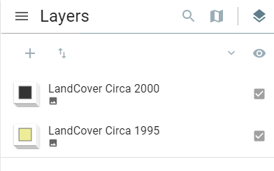

# Overview

The Swiper enables you to easily compare the content of different layers. It provides a horizontal view mode which allows you to interact with the map. You can slide the swipe tool to reveal the content of another layer.

The plugin works with the following mapping services:

- ESRI Feature
- ESRI Dynamic
- ESRI Image
- OGC WMS
- OGC WFS
- OGC WCS

More information on Web map services can be found [here.](https://www.nrcan.gc.ca/earth-sciences/geomatics/canadas-spatial-data-infrastructure/8902){target=\_blank}

 

## Best Pratices

**Get the best out of the Swiper Plugin**

The Swiper is a visualization enhancer used to compare different layers. For example, you may want to use it to show before-and-after imagery of a flood, or display two related thematic layers in a map. You have the capability to move the slider back and forth to see the changes.

**Tips for interacting with the Swiper Plugin**

The recommended way to utilize this plugin effectively is as a comparative tool. You can use the swiper plugin to compare layers for an extra layer of visual analysis. As you swipe, the enabled layer will be temporarily erased relative to the position of the swiper.
It is recommended that the layer with the swiper plugin enabled should be the top most layer in the legend tree.

In the example above, the Swiper plugin is enable on the top most layer. It is important to note that when using the swiper tool with two different layers, the layer with the swiper tool enabled can obscure the underlying layer.

The tool could be used to explore satellite or aerial images of locations before and after disasters such as wildfires or landslides. You can also use this tool to compare historical and current maps to see how change occurs over time.

<figure>
<video style="width:100%"  controls>
  <source src="/assets/videos/swiper/swiper1.mp4" type="video/mp4">
Your browser does not support the video tag.
</video>
</figure>
 

## Use Case Examples

---

**Example 1**

In this example, the swiper plugin was used to highlight the changes in land cover for Agricultural Regions for Canada between 1995 and [2000](https://gcgeo.gc.ca/geonetwork/metadata/eng/16d2f828-96bb-468d-9b7d-1307c81e17b8){target=\_blank}. These layers are examples of ESRI Image layer being used with the swiper plugin.

<iframe id="iframe1" allowfullscreen=true importance = high data-src="https://jolevesq.github.io/contributed-plugins/swiper/samples/swiper-index.html?sample=2"></iframe>

!!! tip

    To identify the active layer of the Swiper plugin, simply place your mouse cursor over the vertical bar of the plugin.

 

**Example 2**

In this example, the swiper plugin was used to highlight the changes in land cover of Canada between 2010 and [2015](https://gcgeo.gc.ca/geonetwork/metadata/eng/4e615eae-b90c-420b-adee-2ca35896caf6){target=\_blank}.

It is important to note that in this example, the two land cover layers are very similiar. However, they are subtle difference which can be easily identified while using the Swiper plugin.

<iframe id="iframe2" allowfullscreen=true importance = high data-src="https://jolevesq.github.io/contributed-plugins/swiper/samples/swiper-index.html?sample=3"></iframe>
 

**Example 3**

In this example, the swiper plugin was used to highlight the Hydro and Petroleum power plants. The swiper plugin was enabled on the 100MW and 1MW Hydropower plants. Using the Swiper plugin you are quickly able to compare the locations of the powerplants while focusing on areas of interest.

<iframe id="iframe3" allowfullscreen=true importance = high data-src="https://jolevesq.github.io/contributed-plugins/swiper/samples/swiper-index.html?sample=1"></iframe>

---

 

## Getting Started

**Configure the Swiper Plugin**

**Step 1.** Ensure the at the Swiper Plugin is enabled.

**Step 2.** Under the Layer Id, Ensure that the correct layer is selected.

> The layer selected here will be the layer the swiper plugin is enabled on.

<figure>
<video style="width:100%"  controls>
  <source src="/assets/videos/swiper/swiper2.mp4" type="video/mp4">
Your browser does not support the video tag.
</video>
</figure>
---

### Parameter Definition

To configure this plugin to work with a mapping web service the following parameters are required.

<table>
  <tr>
    <th></th>
    <th>Parameters</th>
    <th>Description</th>
  </tr>
 <tr>
    <th rowspan="2">General</th>
    <td id=parameters>Type</td>
    <td>Determines of the swiper is vertical or horizontal. Note: Only vertical is supported at the moment</td>
  <tr>
    <td id=parameters>Keyboard Offset</td>
    <td>Determines the number of pixels to move the swiper when the keyboard is used for navigation</td>
  </tr>
  <tr>
    <th rowspan="1">Layers</th>
    <td id=parameters>Id</td>
    <td>Layer id as defined in layer section</td>
  </tr>
</table>
