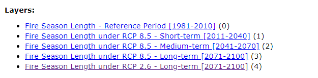
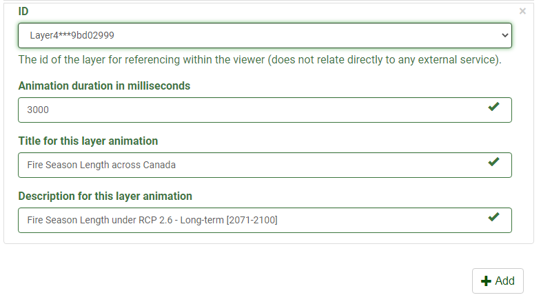

# What is the Thematic Slider

The Thematic Slider plugin provides a way to quickly visualize a theme as it loops through an array of layers to highlight accumulations or evolution of geolocation data. The thematic slider offers one of the simplest ways to display change over time for raster datasets that are not time enabled. At the same time, the plugin can show title and description for each of the layers allowing you to give greater context and meaning.

!!! note

    A thematic map can also show the spatial distribution of identifiable
    earth surface features. Themes can range from, for example, categories
    such as vegetation, soil and surface water. It is implied in the construction of a theme.

 

## Advantages of the Thematic Slider

**What are the advantages of using the Thematic Slider plugin?**

The Thematic Slider plugin offers many advantages to both the data contributor and the user.

1.  If the data contributor has multiple layers each corresponding to a single map for a particular time:

    - The Thematic Slider offers the ability to list all the layers to be displayed in order one after the other.

    - The plugin allows for the ability to automatically cycle through / animate the layers when the map is loaded.

    - If there is an extra context that can further explain/enhance the user experience or provide more information about the layer, the plugin allows for it to be placed.

2.  The main advantage to the user is the overall experience of being able to view cumulative change over time with no effort. Having all the layers being pre-organized in order and the extra context provided, the user can quickly make any inferences from the dataset all within a short time.

 

## Best Pratices

**Get the best out of the Thematic Slider**

The Thematic Slider plugin is best used in cases where there are multiple raster layers (static maps) that correspond to a particular time. In this regard, it provides the ability to focus on the change occurring over each time as it cycles through each map.

Take, for example, this map service, [Fire Season Length under RCP 8.5](https://gcgeo.gc.ca/geonetwork/metadata/eng/99875416-4ef0-4dc1-889f-aa098beb7950){target=\_blank}.

If we look at the available layers corresponding to Fire Season Length under RCP 8.5, we can note that 3 different map layers are representing **Short Term (2011-2040)**, **Medium Term (2041-2070)** and **Long Term (2071-2100)**. If this were to be displayed all together on a single map, some issues may arise such as:

- When all the layers are enabled, overlapping features will be hidden and it will be difficult to identify any cumulative change.
- It is easy to disorganize the order of the layers. This is especially true when dealing with large datasets.

Integrating the Thematic Slider plugin with this rich dataset allows the ability to cycle through each map layer providing any extra context as needed. The user can quickly navigate between each layer individually as well as the option to cycle through the layer at a predetermined time.

<iframe id="iframe1" allowfullscreen=true importance = high data-src="https://jolevesq.github.io/contributed-plugins/thematic-slider/samples/thematic-slider-index.html?sample=9"></iframe>

 

## Use Case Examples

---

In this example, the Thematic Slider plugin was used to highlight [xSO4D wet deposition maps 1981-2015](https://gcgeo.gc.ca/geonetwork/metadata/eng/e8896575-1fb8-4e53-8acd-8579c3c055c2){target=\_blank}. This map service has a total of 36 layers each showing the XS04D. The thematic slider provides the ability to load each layer and cycle through them highlighting change over time.

 

This particular map service has a total of 36 layers present. Although using all 36 layers is possible it is not recommended. Loading all 36 maps at the same time results in extra time required for loading.
For this use case, the thematic slider was used to show cumulative change for every 10 years between 1981 – 2015.

<iframe id="iframe1" allowfullscreen=true importance = high data-src="https://jolevesq.github.io/contributed-plugins/thematic-slider/samples/thematic-slider-index.html?sample=8"></iframe>

!!! tip

    It is recommended to use the thematic slider with no more than 15 layers at a time. Testing has shown that a maximum of 15 layers meets the optimal loading time as recommended by the FGP Data team.

    If there is a case where there are multiple layers to be used with the thematic slider, you may consider adjusting the time between the layers. For example, if there is a dataset consisting of raster layers spanning from 1990 – 2020, you can consider adding layers after every 10 years. This simple change allows overall load time performance to improve as well as highlighting change occurring every decade

---

 

## Configure the Thematic Slider Plugin

The plugin works with the following mapping services:

- ESRI Feature
- ESRI Dynamic
- OGC WMS

More information on Web map services can be found [here.](https://www.nrcan.gc.ca/earth-sciences/geomatics/canadas-spatial-data-infrastructure/8902){target=\_blank}

---

## Definition of Parameters

To configure this plugin to work with a mapping web service the following parameters are required.

<table>
  <tr>
    <th></th>
    <th>Parameters</th>
    <th>Description</th>
  </tr>
 <tr>
    <th rowspan="6">General</th>
    <td id=parameters>Open</td>
    <td>This plugin can be set to open automatically when a map loads. By default it is set open on map load</td>
  </tr>
  <tr>
    <td id=parameters>Auto run</td>
    <td>Determines if the plugin will start the animation automatically</td>
  </tr>
    <tr>
    <td id=parameters> Loop</td>
    <td>Determines if the plugin will restart the animation automatically when it reaches the end of the array</td>
  </tr>
    <tr>
    <td id=parameters>Description</td>
    <td>Determines if the description control is available</td>
  </tr>
    <tr>
    <td id=parameters>Slider</td>
    <td>Determines if the slider controls are available. Note: Description needs to be true for the slider to be enabled</td>
  </tr>
    <tr>
    <td id=parameters>Stack</td>
    <td>Determines if only the active layer is shown or if the visibility of all the layers are stacked. Layers are stacked from -Layer 0 to the active layer</td>
  </tr>
  <tr>
    <th rowspan="5">Layers</th>
    <td id=parameters>Id</td>
    <td>Determines the layer id as defined in the layer section.</td>
  </tr>
  <tr>
    <td id=parameters>Field</td>
    <td>layer id as define in layer section</td>
  </tr>
    <tr>
    <td id=parameters>Duration</td>
    <td>duration in millisecond to stay on the active layer</td>
  </tr>
    <tr>
    <td id=parameters>Title</td>
    <td>Title to show in description control</td>
  </tr>
    <tr>
    <td id=parameters>Description</td>
    <td>Text to show inside description control</td>
  </tr>
</table>

## Step-By-Step Guide

**Step 1.** Ensure that the Thematic Slider Plugin is enabled.

{: class="guide"}

**Step 2.** Select the options you want the Thematic Slider to do:

- Start animation on load
- Play the animation on loop
- Stack layer visibility

!!! note

    By default, the following will be enabled:

    - Open by default
    - Enable description control
    - Enable slider control

**Step 3.** Under Layers, select the layer which the plugin will be enabled on.
Set the Animation duration, Title for layer animation, and Description for layer animation

{: class="guide"}

**Step 4.** Optional, Click on the Add Button to create new entries for additional layers.

{: class="guide"}

{: class="guide"}
