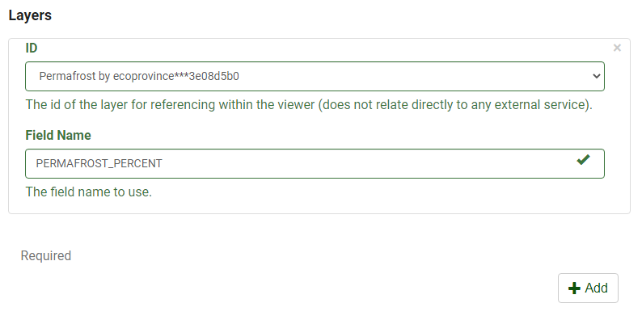

# Configure the Range/Time Slider Plugin

The plugin works with the following mapping services:

- ESRI Feature
- ESRI Dynamic
- ESRI WMS
- ESRI Image
- OGC WMS
- OGC WMS-T
- OGC WCS

More information on Web map services can be found [here.](https://www.nrcan.gc.ca/earth-sciences/geomatics/canadas-spatial-data-infrastructure/8902)

## Definition of Parameters

To configure this plugin to work with a mapping web service the following parameters are required.

<table>
  <tr>
    <th></th>
    <th>Parameters</th>
    <th>Description</th>
  </tr>
  <tr>
    <th rowspan="1">General</th>
    <td id=parameters>Open</td>
    <td >Determines if the plugin will open/load automatically when a layer loads. By default it is set to open on map load</td>
  </tr>
  <tr>
    <th rowspan="5">Slide Bar Controls</th>
    <td id=parameters>Lock</td>
    <td>Lock or unlock left anchor when step or play</td>
  </tr>
  <tr>
    <td id=parameters>Loop</td>
    <td>Loop the animation</td>
  </tr>
    <tr>
    <td id=parameters>Delay</td>
    <td>Add a dropdown menu to change the delay in play animation</td>
  </tr>
    <tr>
    <td id=parameters>Export</td>
    <td>Ability to export the animation to a GIF</td>
  </tr>
    <tr>
    <td id=parameters>Refresh</td>
    <td>Reset the slider with the default values</td>
  </tr>
  <tr>
    <th rowspan="6">Params</th>
    <td id=parameters> Type</td>
    <td>Determines the type of slider (date or number) to be used. If date is selected, range and limit must be in milliseconds.</td>
  </tr>
  <tr>
    <td id=parameters>Units</td>
    <td>Determines the units label to add the right of the slider bar.</td>
  </tr>
    <tr>
    <td id=parameters>Description</td>
    <td>This allows for a description to be added to the slider information section. By default, the layer name and field will be included.</td>
  </tr>
    <tr>
    <td id=parameters>Delay</td>
    <td>Sets the delay between animations in milliseconds</td>
  </tr>
    <tr>
    <td id=parameters>Range</td>
    <td>Determines the minimum and maximum range values to be used in the plugin
        <ol type="i">
          <li id=tablelist>Minimum - Set the minimum value for the range slider. If this is not set the minimum range will be determined from the field selected.</li>
          <li id=tablelist>Maximum – Set the maximum value for the range slider. If this is not set the maximum range will be used</li>
        </ol>
    </td>
  </tr>
    <tr>
    <td id=parameters>Limit</td>
    <td>Determines the minimum and maximum limit values to be used in the plugin
         <ol type="i">
          <li id=tablelist>Minimum - Set the minimum value for the range slider. If this is not set the minimum range will be determined from the field selected.</li>
          <li id=tablelist>Maximum – Set the maximum value for the range slider. If this is not set the maximum range will be used</li>
        </ol>
    </td>
  </tr>
  <tr>
    <th rowspan="2">Layers</th>
    <td id=parameters>Id</td>
    <td>Determines the layer id as defined in the layer section.</td>
  </tr>
  <tr>
    <td id=parameters>Field</td>
    <td>Determines the field name of the field to be used to filter with the range slider. It is important to note that the field name has to be used and not the alias of the field.</td>
  </tr>
</table>

## Step By Step Guide

**Step 1.** Ensure that the Range/Time Slider Plugin is enabled.

{: class="guide"}

**Step 2.** Under Slider bar controls, choose whether you want the slider to do the following:

- Lock/unlock minimal range
- Loop playback.
- Export animation as GIF
- Delay between animation
- Refresh

**Step 3.** Choose the Slider Type- Under the Slider Type, select one of the two options, **Number** or **Date**. This corresponds to the data attribute that will be used with the plugin.

{: class="guide"}

**Step 4**. Set the animation delay. The default is 3sec.

**Step 5.** Under layers, select the layer which the plugin will be enabled on.

{: class="guide"}

In this example, the layer id is “Permafrost by ecoprovience” and the field name is “PERMAFROST_PERCENT”.

{: class="guide"}

!!! note

    The exact field name must be used, not the alias.
