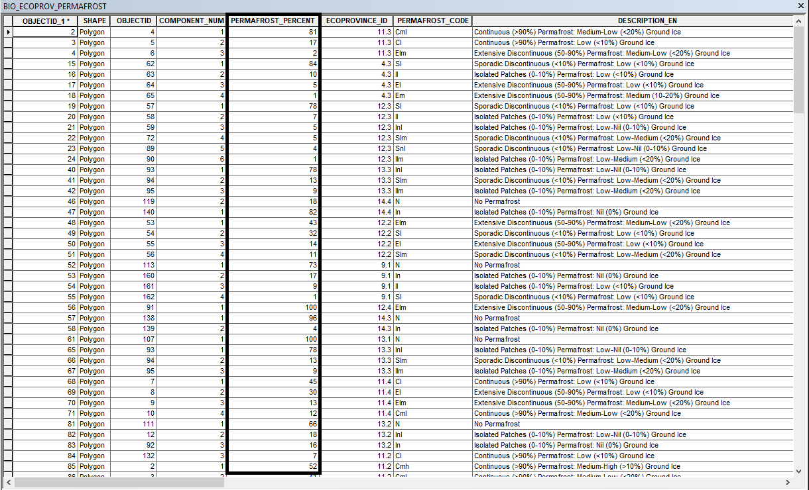

## Use Case Examples

---

**Range Slider**

In this example, the Range / Time Slider plugin was used with the Permafrost by ecoprovince [layer](https://gcgeo.gc.ca/geonetwork/metadata/eng/4baa66ad-aa29-4233-a6a8-7f5cbefb5ea8). This layer is an example of an ESRI Feature layer being used with the range slider. The PERMAFROST_PERCENT field was used with the range slider plugin to give the ability to the viewer to select specific percentages of permafrost they may be interested in.

It is important to note the data structure of this layer. Looking closer at this dataset we can see that the PERMAFROST_PERCENT field consists of only integers. This enables the range slider to automatically identify the limits of the ranges present.

<iframe width=960px height="450"
        src=https://jolevesq.github.io/contributed-plugins/range-slider/samples/range-slider-index.html?sample=10>
</iframe>

---

**Time Slider**

In this example, the Range/Time Slider was used with the [Ocean Data Inventory Temperature](https://gcgeo.gc.ca/geonetwork/metadata/eng/7da1f04f-49b0-4208-a49e-d0597b1f55c6) and [Ocean Data Inventory Salinity](https://gcgeo.gc.ca/geonetwork/metadata/eng/7da1f04f-49b0-4208-a49e-d0597b1f55c6) datasets. The plugin was used with the “COLLECTION_START_DATE” it is interesting to note that both layers share the same field in this example. This made it easier to use the Range/Time Slider plugin with both layers simultaneously.

<iframe width=960px height="550" allowfullscreen=true
        src=https://jolevesq.github.io/contributed-plugins/range-slider/samples/range-slider-index.html?sample=11>
</iframe>

!!! tip

    Use the anchors on the left and right to set the range of values to be displayed.
