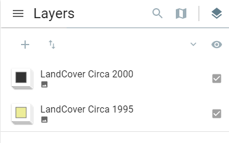

# Swiper Plugin

The Swiper enables you to easily compare the content of different layers. It provides a horizontal view mode which allows you to interact with the map. You can slide the swipe tool to reveal the content of another layer.

The plugin works with the following mapping services:

- ESRI Feature
- ESRI Dynamic
- ESRI Image
- OGC WMS
- OGC WFS
- OGC WCS

More information on Web map services can be found [here.](https://www.nrcan.gc.ca/earth-sciences/geomatics/canadas-spatial-data-infrastructure/8902)

 

## Best Pratices

**Get the best out of the Swiper Plugin**

The Swiper is a visualization enhancer used to compare different layers. For example, you may want to use it to show before-and-after imagery of a flood, or display two related thematic layers in a map. You have the capability to move the slider back and forth to see the changes.

**Tips for interacting with the Swiper Plugin**

The recommended way to utilize this plugin effectively is as a comparative tool. You can use the swiper plugin to compare layers for an extra layer of visual analysis. As you swipe, the enabled layer will be temporarily erased relative to the position of the swiper.
It is recommended that the layer with the swiper plugin enabled should be the top most layer in the legend tree.

In the example above, the Swiper plugin is enable on the top most layer. It is important to note that when using the swiper tool with two different layers, the layer with the swiper tool enabled can obscure the underlying layer.

The tool could be used to explore satellite or aerial images of locations before and after disasters such as wildfires or landslides. You can also use this tool to compare historical and current maps to see how change occurs over time.

<iframe width=960px height="550" allowfullscreen=true
        src=https://jolevesq.github.io/contributed-plugins/swiper/samples/swiper-index.html?sample=2>
</iframe
