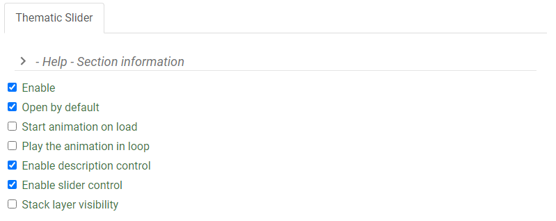

# Configure the Thematic Slider Plugin

The plugin works with the following mapping services:

- ESRI Feature
- ESRI Dynamic
- OGC WMS

More information on Web map services can be found [here.](https://www.nrcan.gc.ca/earth-sciences/geomatics/canadas-spatial-data-infrastructure/8902)

---

## Definition of Parameters

To configure this plugin to work with a mapping web service the following parameters are required.

<table>
  <tr>
    <th></th>
    <th>Parameters</th>
    <th>Description</th>
  </tr>
 <tr>
    <th rowspan="6">General</th>
    <td id=parameters>Open</td>
    <td>This plugin can be set to open automatically when a map loads. By default it is set open on map load</td>
  </tr>
  <tr>
    <td id=parameters>Auto run</td>
    <td>Determines if the plugin will start the animation automatically</td>
  </tr>
    <tr>
    <td id=parameters> Loop</td>
    <td>Determines if the plugin will restart the animation automatically when it reaches the end of the array</td>
  </tr>
    <tr>
    <td id=parameters>Description</td>
    <td>Determines if the description control is available</td>
  </tr>
    <tr>
    <td id=parameters>Slider</td>
    <td>Determines if the slider controls are available. Note: Description needs to be true for the slider to be enabled</td>
  </tr>
    <tr>
    <td id=parameters>Stack</td>
    <td>Determines if only the active layer is shown or if the visibility of all the layers are stacked. Layers are stacked from -Layer 0 to the active layer</td>
  </tr>
  <tr>
    <th rowspan="5">Layers</th>
    <td id=parameters>Id</td>
    <td>Determines the layer id as defined in the layer section.</td>
  </tr>
  <tr>
    <td id=parameters>Field</td>
    <td>layer id as define in layer section</td>
  </tr>
    <tr>
    <td id=parameters>Duration</td>
    <td>duration in millisecond to stay on the active layer</td>
  </tr>
    <tr>
    <td id=parameters>Title</td>
    <td>Title to show in description control</td>
  </tr>
    <tr>
    <td id=parameters>Description</td>
    <td>Text to show inside description control</td>
  </tr>
</table>

## Step-By-Step Guide

**Step 1.** Ensure that the Thematic Slider Plugin is enabled.

{: class="guide"}

**Step 2.** Select the options you want the Thematic Slider to do:

- Start animation on load
- Play the animation on loop
- Stack layer visibility

!!! note

    By default, the following will be enabled:

    - Open by default
    - Enable description control
    - Enable slider control

**Step 3.** Under Layers, select the layer which the plugin will be enabled on.
Set the Animation duration, Title for layer animation, and Description for layer animation

{: class="guide"}

**Step 4.** Optional, Click on the Add Button to create new entries for additional layers.

{: class="guide"}

{: class="guide"}
