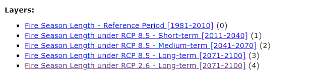

# Thematic Slider Plugin

**What is the Thematic Slider?**

The Thematic Slider plugin provides a way to quickly visualize a theme as it loops through an array of layers to highlight accumulations or evolution of geolocation data. The thematic slider offers one of the simplest ways to display change over time for raster datasets that are not time enabled. At the same time, the plugin can show title and description for each of the layers allowing you to give greater context and meaning.

!!! note

    A thematic map can also show the spatial distribution of identifiable
    earth surface features. Themes can range from, for example, categories
    such as vegetation, soil and surface water. It is implied in the construction of a theme.

 

## Advantages of the Thematic Slider

**What are the advantages of using the Thematic Slider plugin?**

The Thematic Slider plugin offers many advantages to both the data contributor and the user.

1.  If the data contributor has multiple layers each corresponding to a single map for a particular time:

    - The Thematic Slider offers the ability to list all the layers to be displayed in order one after the other.

    - The plugin allows for the ability to automatically cycle through / animate the layers when the map is loaded.

    - If there is an extra context that can further explain/enhance the user experience or provide more information about the layer, the plugin allows for it to be placed.

2.  The main advantage to the user is the overall experience of being able to view cumulative change over time with no effort. Having all the layers being pre-organized in order and the extra context provided, the user can quickly make any inferences from the dataset all within a short time.

 

## Getting the best out of the Thematic Slider

The Thematic Slider plugin is best used in cases where there are multiple raster layers (static maps) that correspond to a particular time. In this regard, it provides the ability to focus on the change occurring over each time as it cycles through each map.

Take, for example, this map service, [Fire Season Length under RCP 8.5](https://gcgeo.gc.ca/geonetwork/metadata/eng/99875416-4ef0-4dc1-889f-aa098beb7950).

If we look at the available layers corresponding to Fire Season Length under RCP 8.5, we can note that 3 different map layers are representing **Short Term (2011-2040)**, **Medium Term (2041-2070)** and **Long Term (2071-2100)**. If this were to be displayed all together on a single map, some issues may arise such as:

- When all the layers are enabled, overlapping features will be hidden and it will be difficult to identify any cumulative change.
- It is easy to disorganize the order of the layers. This is especially true when dealing with large datasets.

Integrating the Thematic Slider plugin with this rich dataset allows the ability to cycle through each map layer providing any extra context as needed. The user can quickly navigate between each layer individually as well as the option to cycle through the layer at a predetermined time.

<iframe width=960px height="450"
        src=https://jolevesq.github.io/contributed-plugins/thematic-slider/samples/thematic-slider-index.html>
</iframe
