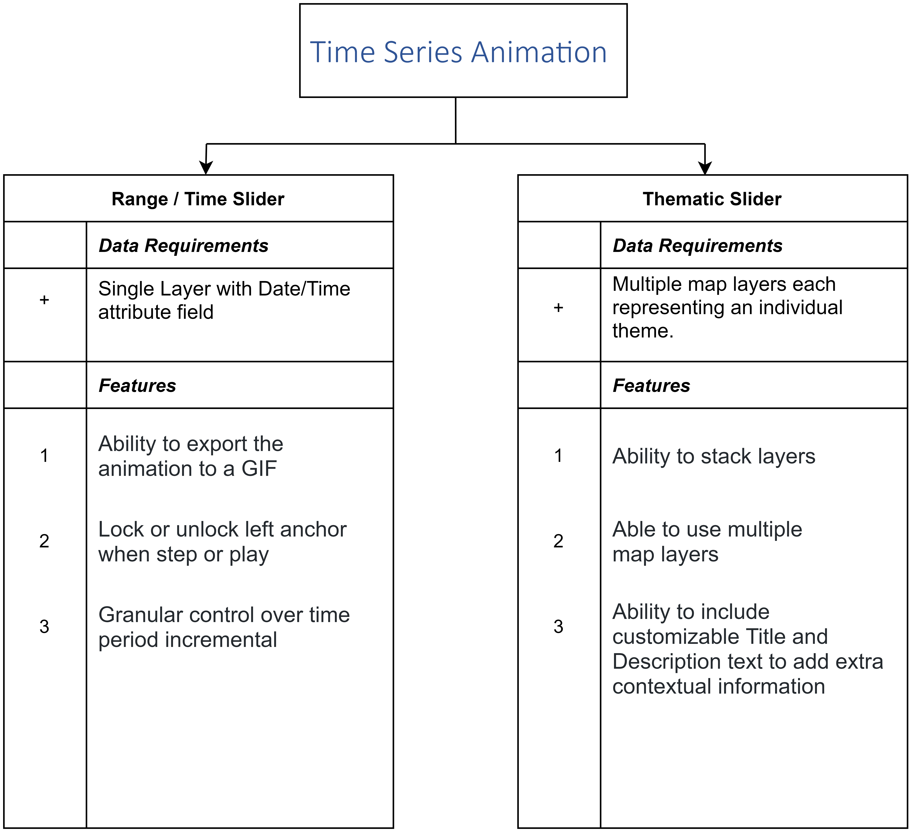

# Time Series Animation

Animations are an interesting way of visualizing time-series data. It distinctively gives the ability to observe how the data evolves. Depending on your data structure, there are two options available to implement time-series animations to your dataset.

1. [Range / Time Slider Plugin](rangetimeslider/overview.md)
2. [Thematic Slider Plugin](thematicslider/overview.md)

 

## Workflow

---

**[Range / Time Slider Plugin](rangetimeslider/overview.md)**

If your data has an attribute where the date is listed then the range/time slider is the best option to be used. The most important requirement is that your date column contains valid timestamp values, otherwise the data may not appear correctly. A column that includes a timestamp could be a date, created at, updated at, posted time, and so on. For example, the following image shows the value of a date column in the Data View.

**[Thematic Slider Plugin](thematicslider/overview.md)**

If your dataset consists of multiple raster layers (static maps) as a map service that corresponds to a particular period then the raster time slider is the best option.
